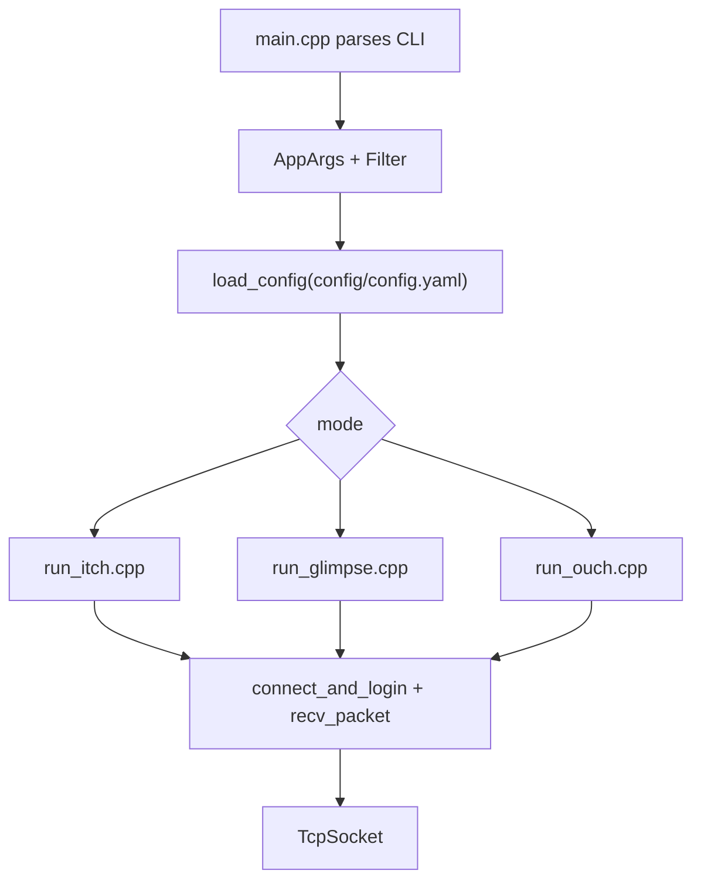
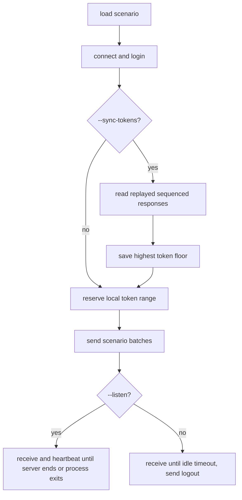

# SoupBinTCP Client

Small C++17 SoupBinTCP client for Japannext PTS market data and order-entry
testing. It can:

- connect to ITCH realtime market data
- connect to Glimpse snapshot market data
- send raw OUCH messages from scenario files
- repeat OUCH scenarios at a fixed send rate
- keep an OUCH session connected with `--listen`
- sync the local OUCH token counter from replayed server responses

References:

- https://www.japannext.co.jp/pub_data/pub_onboarding/JNX_OUCH_Trading_Specification_Equities_2.01.pdf
- https://www.japannext.co.jp/pub_data/pub_onboarding/JNX_ITCH_Market_Data_Specification_Equities_2.01.pdf
- https://www.japannext.co.jp/pub_data/pub_onboarding/JNX_GLIMPSE_Market_Data_Specification_Equities_2.01.pdf

## Build

```sh
make
```

The binary is written to `./soupbin_client`.

## Configuration

Sessions live in `config/config.yaml`. Each protocol entry points at a JSON
message spec and contains one or more named sessions.

```yaml
protocols:
  ouch:
    protocol_spec: "specs/OUCH.json"
    heartbeat_interval_sec: 1
    sessions:
      - key: o01
        server_ip: "10.0.0.1"
        server_port: 12345
        username: "user01"
        password: "pass123456"
```

Use the session key with `-u`.

## Usage

ITCH realtime:

```sh
./soupbin_client --mode itch -u i01 -s 1 -n 100 --type P --security 9984
```

Glimpse snapshot:

```sh
./soupbin_client --mode glimpse -u g01 --security 9984
```

OUCH, send one scenario and disconnect after responses go idle:

```sh
./soupbin_client --mode ouch -u o01 --scenario scenarios/new_single
```

Scenario paths are opened as given, so any suffix works when that file exists:

```sh
--scenario scenario
--scenario scenario.ouch
--scenario scenario.txt
```

OUCH, send the scenario 100 times at 10 outbound messages per second and keep
the session connected so Cancel-on-Disconnect does not remove live orders:

```sh
./soupbin_client --mode ouch -u o01 \
  --scenario scenarios/new_single \
  --order-count 100 \
  --rate 10 \
  --listen
```

OUCH, replay server responses first, save the highest observed token to
`tokens/<username>_<yyyymmdd>.token`, then send:

```sh
./soupbin_client --mode ouch -u o01 \
  --scenario scenarios/new_single \
  --sync-tokens
```

`--sync-tokens` logs in from sequence `1` by default. Pass `-s <seq>` when you
want to start replay from a different OUCH sequence.

## OUCH Scenarios

Scenario lines are pipe-delimited complete SoupBinTCP application messages:

```text
49|U|O|TK01|TEST000001|B|100|9984|NGHT|32800|99999|0||A|0|1|1
```

Format:

```text
<packet_length>|U|<ouch_message_type>|<field1>|<field2>|...
```

`TK00` through `TK99` are token placeholders. The client replaces each unique
placeholder with an increasing local token before sending. Repeating a scenario
reserves a fresh token range for every repeat.

## Flow



OUCH flow:



## Notes

- Japannext OUCH token fields must increase during the trading day. If a token
  is out of sequence, an Enter Order can be silently ignored by the server.
- Japannext OUCH Cancel-on-Disconnect is always active. Use `--listen` when
  you want accepted day orders to remain live after the initial send.
- `--listen` only keeps the session connected. The order is expected in the
  book only after an `OrderAccepted` response with `OrderState=L`.
- `--order-count 0` repeats forever. Combine it with `--rate` to avoid sending
  faster than intended.
